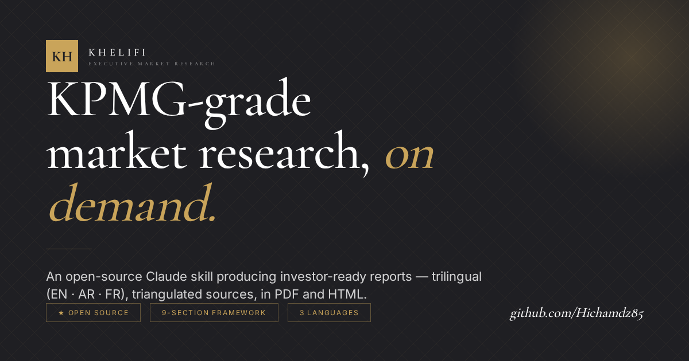
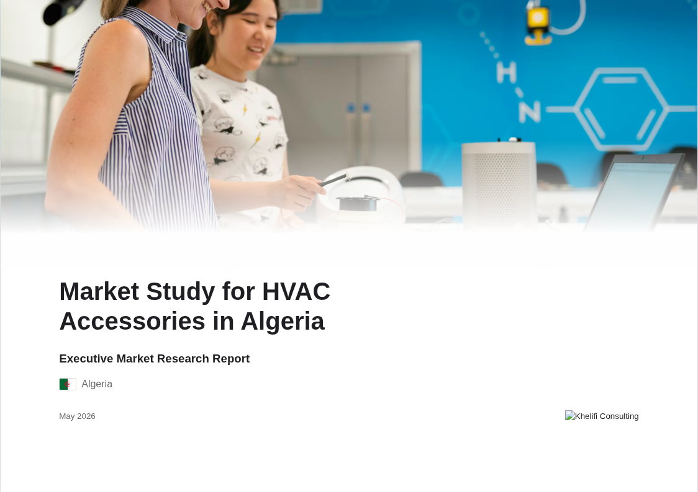
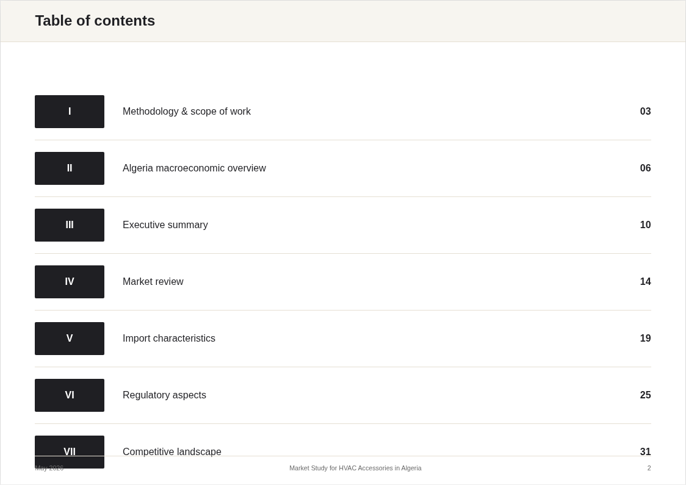
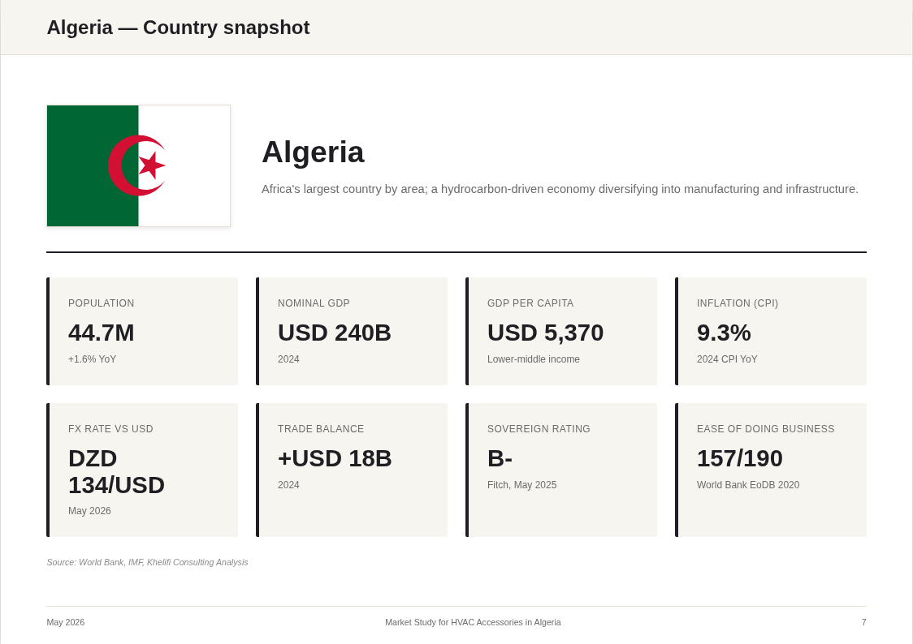
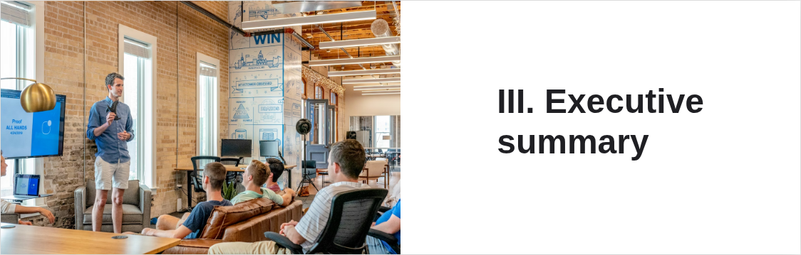
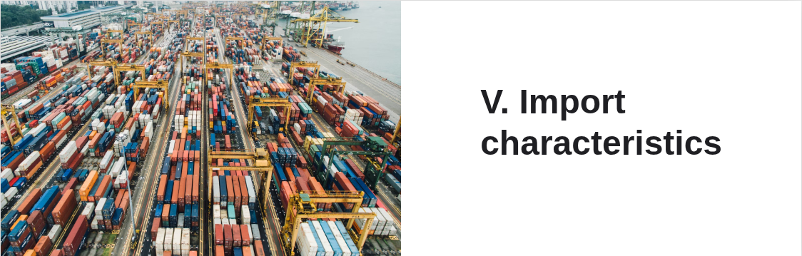
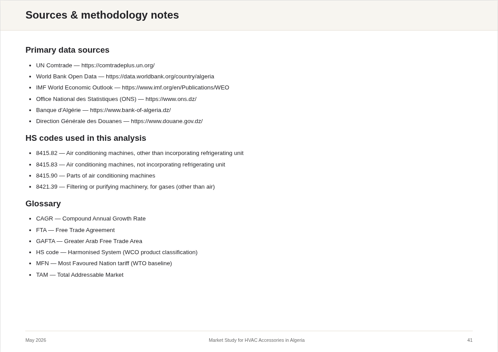

<div align="center">



# Executive Market Research

### A Claude Skill producing Khelifi Consulting-grade market research reports — in PDF and interactive HTML — for any product, sector, or country.

[](https://github.com/Hichamdz85/executive-market-research/releases)
[](https://opensource.org/licenses/MIT)
[](https://github.com/Hichamdz85/executive-market-research/actions)
[](https://github.com/Hichamdz85/executive-market-research/stargazers)
[](https://claude.ai)
[](#languages)
[](#contributing)

**Three languages · Live web research · Investor-grade output · Free & open source**

[🌐 Live demo](https://hichamdz85.github.io/executive-market-research/) · [⚡ Quick start](#quick-start) · [🎯 How it works](#how-it-works) · [📚 Methodology](reference/khelifi_research_playbook.md) · [📥 Sample report (PDF)](https://github.com/Hichamdz85/executive-market-research/releases/latest)

</div>

---

## What it does

Hand it a product and a country — get back a **35–45 page consulting deliverable** that looks like Khelifi Consulting, Deloitte, or McKinsey produced it. No templates to fill in, no slides to design. Claude handles the research, the analysis, the charts, and the layout.

```
You:    "Market research for HVAC accessories in Algeria, in English"
Claude: → researches the web (UN Comtrade, World Bank, IMF, ONS, EIU…)
        → triangulates every headline number from 3+ sources
        → builds a 9-section report with charts, SWOT, recommendations
        → outputs report.pdf + report.html

You:    receive the deliverable, ready to send to a board / investor / client.
```

## Why it's different

| Other "AI report" tools | This skill |
|-------------------------|-----------|
| Generic templates filled with bullet points | Real consulting structure (9 sections, executive-grade) |
| Single-source generation | **Triangulation rule**: 3+ sources per headline number |
| English only | **English + Arabic (RTL) + French** |
| Plain HTML output | PDF + interactive HTML, fully branded |
| Hallucinated numbers | Live web research, every number cited |
| One-size-fits-all design | Country flag + macro dashboard + sector-specific imagery |

## What it produces

<table>
<tr>
<td width="33%" align="center"><b>Cover page</b><br><sub>Hero image · Country flag · Author logo · Date</sub></td>
<td width="33%" align="center"><b>Table of contents</b><br><sub>9 numbered sections, page-mapped</sub></td>
<td width="33%" align="center"><b>Country snapshot</b><br><sub>8-tile KPI dashboard · GDP · trade balance</sub></td>
</tr>
<tr>
<td></td>
<td></td>
<td></td>
</tr>
<tr>
<td align="center"><b>Macro charts</b><br><sub>GDP trend · trade flows · sourced</sub></td>
<td align="center"><b>Executive summary</b><br><sub>Icon-based segments · finding-as-headline</sub></td>
<td align="center"><b>Market review</b><br><sub>Demand sizing · CAGR · drivers</sub></td>
</tr>
<tr>
<td></td>
<td></td>
<td></td>
</tr>
<tr>
<td align="center"><b>Imports analysis</b><br><sub>Value & volume bar charts · UN Comtrade</sub></td>
<td align="center"><b>Regulatory deep-dive</b><br><sub>Tariffs · FTAs · standards · payment</sub></td>
<td align="center"><b>About the author</b><br><sub>Khelifi Consulting branded back cover</sub></td>
</tr>
<tr>
<td></td>
<td></td>
<td></td>
</tr>
</table>

> 📄 **Try the live sample**: [HTML report (interactive)](https://hichamdz85.github.io/executive-market-research/examples/sample_report_en.html) · [📥 PDF in latest release](https://github.com/Hichamdz85/executive-market-research/releases/latest)

## Quick start

### Option A — Use as a Claude skill (recommended)

1. Clone or download this repo into your Claude skills directory:

   ```bash
   git clone https://github.com/Hichamdz85/executive-market-research.git \
     ~/.claude/skills/executive-market-research
   ```

2. In Claude (Code, Desktop, or API), simply ask:

   > "Use the executive-market-research skill to produce a market study for [product] in [country], in [language]."

3. Claude reads `SKILL.md`, conducts the research, and writes both `report.html` and `report.pdf` to your output folder.

### Option B — Run the generator standalone

Create a research-ready scaffold from only a product and country:

```bash
pip install -r requirements.txt
playwright install chromium

python scripts/generate_report.py \
  --product "HVAC accessories" \
  --country "Algeria" \
  --language en \
  --output ./output/
```

You'll get `output/engagement_en.json`, `output/data.json`,
`output/report_en.html`, and `output/report_en.pdf`.

If you already have a researched `engagement.json` file, render directly:

```bash
python scripts/generate_report.py \
  --data examples/sample_engagement.json \
  --language en \
  --output ./output/
```

> The standalone scaffold is not a finished consulting study. Claude still
> needs to complete live research and replace placeholders with cited,
> triangulated evidence before client delivery.

### Option C — Download a release ZIP

Every tagged release publishes a clean ZIP, sample PDFs in English/Arabic/French,
sample HTML files, and a short demo GIF on the
[GitHub releases page](https://github.com/Hichamdz85/executive-market-research/releases).

## Languages

| Code | Language | Direction | Fonts |
|------|----------|-----------|-------|
| `en` | English  | LTR       | Helvetica / Arial |
| `ar` | Arabic   | RTL       | Cairo / Tajawal / IBM Plex Sans Arabic |
| `fr` | Français | LTR       | Helvetica / Arial |

The full layout (header, footer, charts, tables, SWOT) flips for RTL automatically.

## How it works

```
┌─────────────────────────────────────────────────────────────┐
│  1.  Intake the request (product, country, language, focus) │
├─────────────────────────────────────────────────────────────┤
│  2.  Live web research — Khelifi Consulting 5-phase funnel  │
│       a) Quick orientation (multilingual)                   │
│       b) Official sources (World Bank, IMF, UN, national)   │
│       c) Specialised data (Statista, Euromonitor, EIU…)     │
│       d) Financial & news cross-check                       │
│       e) Academic (Google Scholar, JSTOR for niche depth)   │
├─────────────────────────────────────────────────────────────┤
│  3.  Triangulate (≥3 sources per headline number)           │
├─────────────────────────────────────────────────────────────┤
│  4.  Compose the report                                     │
│       I.   Methodology & scope                              │
│       II.  Country macro overview (with flag + KPIs)        │
│       III. Executive summary (icon-based segments)          │
│       IV.  Market review (demand-side)                      │
│       V.   Import characteristics (supply-side)             │
│       VI.  Regulatory aspects                               │
│       VII. Competitive landscape                            │
│       VIII. Conclusion + SWOT + recommendations             │
│       IX.  Appendix (sources, HS codes, glossary)           │
├─────────────────────────────────────────────────────────────┤
│  5.  Render HTML + PDF (Chart.js / Playwright)              │
└─────────────────────────────────────────────────────────────┘
```

## Research methodology

This skill enforces the **7 Golden Rules** used by **Big 4 consulting firms** - codified into Khelifi Consulting's research methodology:

1. **Triangulation** — every key number from 3+ independent sources
2. **Freshness** — prioritise data <18 months old
3. **Multilingual** — search in English + the country's local languages
4. **Official first** — government and international sources before commercial
5. **Benchmarking** — compare to 2–3 peer countries in the same sector
6. **ESG mandatory** — every report covers Environmental, Social, Governance
7. **Primary research simulation** — propose 5–10 interview questions

Read the full playbook: [reference/khelifi_research_playbook.md](reference/khelifi_research_playbook.md)

## Project structure

```
executive-market-research/
├── SKILL.md                          ← Main skill instructions
├── README.md                         ← This file
├── LICENSE
├── templates/
│   ├── report_en.html                ← English template (LTR)
│   ├── report_ar.html                ← Arabic template (RTL)
│   ├── report_fr.html                ← French template (LTR)
│   └── styles.css                    ← Executive-grade design system
├── scripts/
│   ├── generate_report.py            ← Main pipeline
│   ├── build_engagement.py           ← Product/country scaffold builder
│   └── fetch_assets.py               ← Country flags + section images
├── assets/
│   └── icons/                        ← SVG icons (executive-grade line art)
├── reference/
│   ├── khelifi_research_playbook.md  ← The 7 Golden Rules + 5-phase funnel
│   ├── report_structure.md           ← 9-section breakdown
│   ├── data_sources.md               ← Authoritative source map
│   ├── research_methodology.md       ← Step-by-step research process
│   └── quality_standards.md          ← Pre-delivery checklist
├── examples/
│   ├── sample_engagement.json        ← Reference data file
│   └── sample_report_en.pdf          ← Reference output
├── landing-page/                     ← GitHub Pages source
└── docs/                             ← Preview screenshots
```

## Use cases

- **Export feasibility studies** — "Can we sell our [product] in [country]?"
- **Market entry assessments** — "Is [country] worth entering for [sector]?"
- **Competitive intelligence** — "Who are the players in [market]?"
- **Investor decks (data appendix)** — solid market sizing for fundraising
- **Government / development agency briefs** — sector studies for policy
- **Academic case studies** — country + product economic analysis
- **Quick-turn consulting** — get a 30-page first draft in minutes, polish in hours

## Frequently asked

**Q: Does this replace human consultants?**
A: No. It produces a strong first draft. A human consultant should validate triangulation, run primary interviews, and tailor the recommendations.

**Q: How long does generation take?**
A: 8–15 minutes for the research, 30 seconds for the rendering.

**Q: Can I use my own brand/logo?**
A: Yes. Edit `author_name`, `author_logo`, and the colour variables in `templates/styles.css`.

**Q: Are the numbers accurate?**
A: They come from live web research (UN Comtrade, World Bank, etc.) with triangulation. Always spot-check critical numbers before sending to a client.

**Q: Why three languages?**
A: This skill was designed in the MENA / North Africa context where reports often need to be delivered in Arabic, French, or English depending on the audience. Other languages can be added — see [Contributing](#contributing).

**Q: Can I add other languages?**
A: Yes — copy `templates/report_en.html` to `templates/report_xx.html` and translate the static labels. Send a PR.

## Contributing

PRs welcome. Areas where contributions are especially helpful:

- Additional language templates (ES, PT, DE, ZH, RU, TR, …)
- Sector-specific data source maps in `reference/data_sources.md`
- Country-specific source maps in `reference/khelifi_research_playbook.md`
- Improved chart types (geographic heatmaps, treemaps)
- Better stock photography curation in `assets/images/`

## Author

<table>
<tr>
<td width="120" valign="top">

</td>
<td valign="top">

### **KHELIFI CONSULTING**

*Strategic & Marketing Research · Algeria & MENA region*

📧 **info@khelificonsulting.com**
🌐 [khelificonsulting.com](https://khelificonsulting.com)

We turn market questions into board-ready answers. Available for custom feasibility studies, market entry assessments, competitive intelligence, and bespoke research engagements across North Africa and the GCC.

If this skill helped you ship a better deliverable, ⭐ the repo and reach out — I'd love to hear what you built.

</td>
</tr>
</table>

## نظرة عامة (بالعربية)

**Executive Market Research** هي مهارة Claude مفتوحة المصدر تنتج تقارير دراسات سوق احترافية بصياغة تليق بالمؤسسات الاستشارية الدولية. التقرير يصدر في 35 إلى 45 صفحة (أو موجز تنفيذي مكثف من 8 إلى 10 صفحات في وضع `quick`)، بصيغة PDF و HTML تفاعلي، وبثلاث لغات: الإنجليزية والعربية (مع تنسيق RTL كامل) والفرنسية. كل رقم في التقرير مدعّم بثلاثة مصادر مستقلة على الأقل (UN Comtrade, World Bank, IMF, EIU). متاحة كـ Claude Code Plugin مع MCP Server مدمج.

## Aperçu (en français)

**Executive Market Research** est un skill Claude open-source qui génère des études de marché de niveau cabinet de conseil — 35 à 45 pages en mode complet, ou note de synthèse exécutive de 8 à 10 pages en mode `quick` — au format PDF et HTML interactif, en anglais, arabe (mise en page RTL complète) et français. Chaque chiffre est triangulé contre au moins trois sources indépendantes (UN Comtrade, Banque mondiale, FMI, EIU). Distribué comme Claude Code Plugin avec serveur MCP intégré.

## Plugin / MCP server

This repo doubles as a **Claude Code plugin** (`.claude-plugin/plugin.json`) and ships an **MCP server** (`mcp-server/server.py`) exposing four tools: `get_country_macro`, `get_trade_data`, `search_market_data`, `generate_report`. See [mcp-server/README.md](mcp-server/README.md).

## Quickstart

Three steps in five minutes - see [QUICKSTART.md](QUICKSTART.md).

## Release assets

Tagged releases automatically build:

- `executive-market-research-vX.Y.Z.zip` - clean downloadable skill package
- `sample-report-en.pdf`, `sample-report-ar.pdf`, `sample-report-fr.pdf`
- matching sample HTML files
- `executive-market-research-demo.gif`

## License

MIT — use it, fork it, sell deliverables built with it. See [LICENSE](LICENSE).

---

<div align="center">
<sub>Built with ❤️ for the global consulting community.</sub>
</div>
